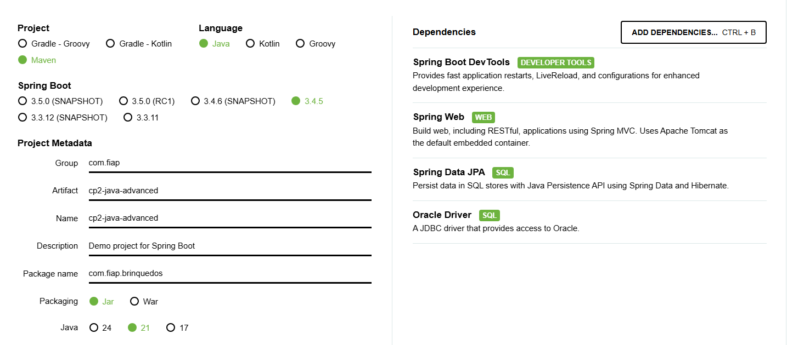

# 🧸 CP2 - API de Brinquedos

Este projeto é uma API RESTful simples para gerenciamento de brinquedos, desenvolvida em Java com Spring Boot. A aplicação permite realizar operações de **criação**, **leitura**, **atualização** e **remoção** (CRUD) de brinquedos.

---

## 👥 Integrantes

- **Felipe Ulson Sora** – RM555462 – [@felipesora](https://github.com/felipesora)
- **Augusto Lope Lyra** – RM558209 – [@lopeslyra10](https://github.com/lopeslyra10)
- **Vinicius Ribeiro Nery Costa** – RM559165 – [@ViniciusRibeiroNery](https://github.com/ViniciusRibeiroNery)

---

## 📦 Estrutura de Classes

### `Brinquedo` (Modelo)
Representa a entidade "Brinquedo" que será persistida no banco de dados.

#### Atributos:
- `Long id` – Identificador único do brinquedo.
- `String nome` – Nome do brinquedo.
- `String tipo` – Tipo ou categoria do brinquedo.
- `String classificacao` – Faixa etária recomendada.
- `String tamanho` – Dimensão física ou porte do brinquedo.
- `Double preco` – Preço do brinquedo.

#### Métodos:
- Getters e Setters para todos os atributos.
- Construtores padrão e completo para inicialização da classe.

---

### `BrinquedoRepository`
Interface que estende `JpaRepository`, responsável por interações com o banco de dados.

#### Função:
- Herdar métodos padrão como `save`, `findById`, `findAll`, `deleteById`, etc.

---

### `BrinquedoService`
Classe de serviço que contém a lógica de negócio da aplicação.

#### Métodos:
- `listarTodos()` – Retorna todos os brinquedos cadastrados.
- `listarPorId(Long id)` – Retorna um brinquedo específico pelo ID.
- `salvar(Brinquedo brinquedo)` – Salva um novo brinquedo no banco de dados.
- `editar(Long id, Brinquedo brinquedo)` – Atualiza os dados de um brinquedo existente.
- `deletar(Long id)` – Remove um brinquedo pelo ID. Retorna uma mensagem de sucesso ou erro.

---

### `BrinquedoController`
Controlador REST responsável por expor os endpoints da API.

#### Endpoints:
- `GET /brinquedos` – Lista todos os brinquedos.
- `GET /brinquedos/{id}` – Retorna um brinquedo específico.
- `POST /brinquedos` – Cadastra um novo brinquedo.
- `PUT /brinquedos/{id}` – Atualiza um brinquedo existente.
- `DELETE /brinquedos/{id}` – Remove um brinquedo e retorna mensagem personalizada.

---

### `SuccessResponse` e `ErrorResponse`
Classes auxiliares para padronizar as respostas de sucesso ou erro.

#### `SuccessResponse`
- Atributo: `message` – Mensagem de sucesso retornada ao usuário.

#### `ErrorResponse`
- Atributo: `errorMessage` – Mensagem de erro personalizada retornada em caso de falha.

---

## 🛠️ Configuração no Spring Initializr



---

## ⚙️ Configurar o Banco de Dados

No arquivo `application.properties` (em `src/main/resources`), configure os dados do banco Oracle:

```bash
spring.datasource.url=SUA_URL
spring.datasource.username=SEU_USUARIO
spring.datasource.password=SUA_SENHA
```

---

## 📡 Endpoints da API

### 🆕 POST – Criar Brinquedo

- `POST - http://localhost:8080/brinquedos`  
  Cadastra um novo brinquedo.

```jsonc
{
  "nome": "Carrinho Hot Wheels",
  "tipo": "Carrinho",
  "classificacao": "A partir de 3 anos",
  "tamanho": "Pequeno",
  "preco": 19.99
}
```

### 📋 GET – Listar Brinquedos

- `GET - http://localhost:8080/brinquedos`  
  Lista todos os brinquedos cadastrados.

### 🔍 GET by ID – Buscar Brinquedo

- `GET - http://localhost:8080/brinquedos/{id}`  
  Retorna o brinquedo com o ID especificado.

### ✏️ PUT – Atualizar Brinquedo

- `PUT - http://localhost:8080/brinquedos/{id}`  
  Atualiza os dados do brinquedo com o ID informado.

```jsonc
{
  "id": 1
  "nome": "Carrinho Hot Wheels",
  "tipo": "Carrinho",
  "classificacao": "A partir de 3 anos",
  "tamanho": "Pequeno",
  "preco": 39.99 // alterando o valor do preço
}
```
### ❌ DELETE – Remover Brinquedo

- `DELETE - http://localhost:8080/brinquedos/{id}`  
  Remove o brinquedo com o ID especificado.

---

## 📌 Tecnologias Utilizadas
- Java 21
- Spring Boot
- Spring Data JPA
- Banco de dados Oracle (ou qualquer banco compatível com JPA)
- Maven

---

## ✅ Funcionalidades Implementadas
- Cadastro de brinquedos
- Listagem geral e individual
- Edição de brinquedos existentes
- Exclusão com mensagens personalizadas
- Respostas diferenciadas para sucesso e erro

---